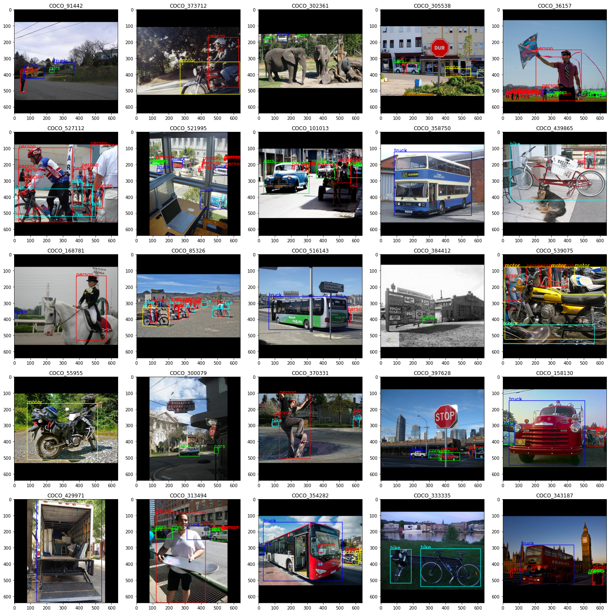
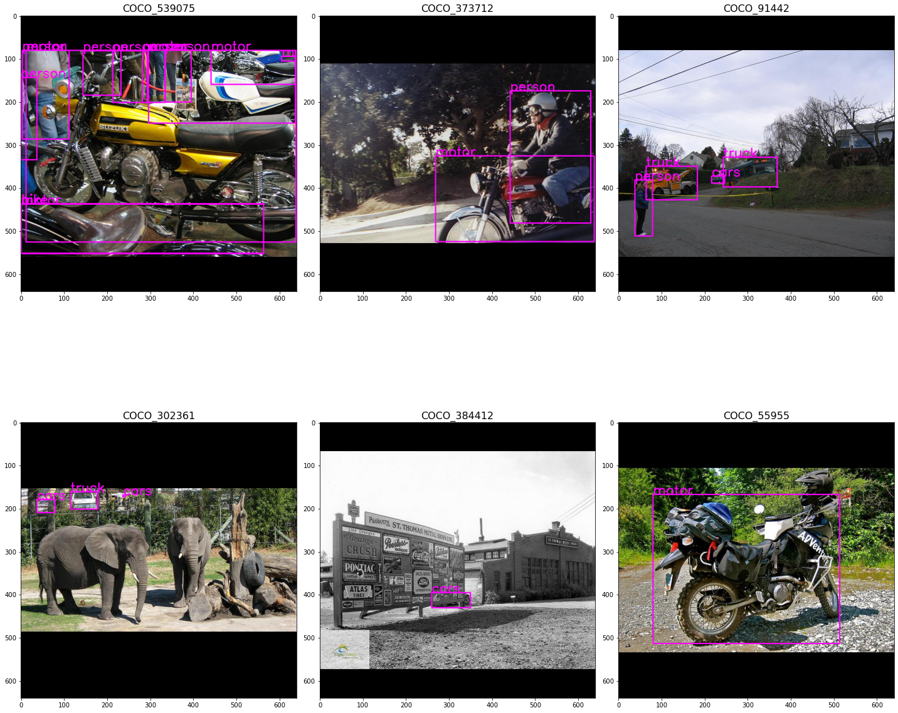

# Image & XML annotation plot
To provide visualization of image with its bounding boxes, with annotations in XML format (pascal VOC format).

1. img_xml_plot.py
    - image subplots are randomly chosen from the images folder passed in
    - maximum 10 object classes

2. quick_xml_plot.py
    - allow user to specify the list of image filenames to view
    - if length of list passed in is more than 6, only 6 image subplots will be randomly chosen and displayed at one time.
    - no limitation on number of object class
